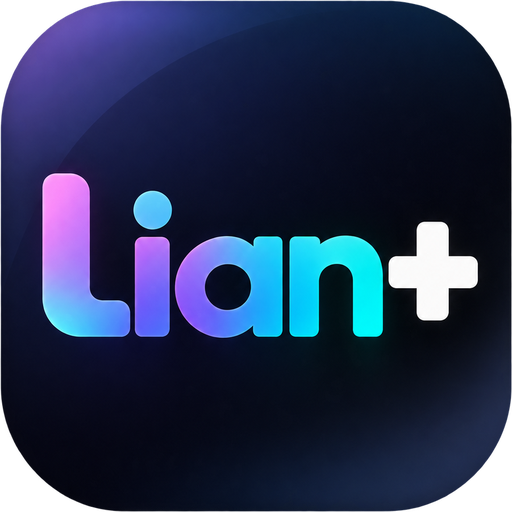

<div align="center">



# Lian+

**Local AI. Limitless You.**

</div>


An Android app that downloads, serves and runs language and image models **entirely
on the phone**. No account, no API key, no inference server. It reads the device's
hardware first and tells you what it can realistically run before you spend four
gigabytes of mobile data finding out.

Built on [llama.cpp](https://github.com/ggml-org/llama.cpp) for text and
[stable-diffusion.cpp](https://github.com/leejet/stable-diffusion.cpp) for images.

---

## What it does

**Checks the device first.** Reads RAM, CPU cores and clocks, Arm extensions
(`dotprod`, `i8mm`), GPU, free storage and thermal state, then gives a verdict:
which model sizes fit, how much context, how many threads, and a tokens/second
estimate so the numbers are not a surprise later.

**Finds and downloads models.** Searches the Hugging Face Hub for GGUF
repositories, lists every quantisation with its real size, marks the best fit for
your device and warns about the ones that will not fit. Downloads resume after
an interruption. There is also a short curated list, filtered to what the phone
can handle, for when you just want something that works.

**Chats, with the parts that make a small model useful:**

- *Context management* — the system prompt and the newest turns are pinned, older
  turns are fitted into whatever budget remains, and the overflow is compressed
  into a running summary rather than silently dropped.
- *Tool calling* — clock, calculator, device info, durable memory, document
  search, image generation, and optional web search and page fetch. Four
  different tool-call syntaxes are parsed, because local models are not
  consistent about which one they emit.
- *Retrieval over your own documents* — import a text file, it is chunked on
  sentence boundaries, embedded locally and searched by cosine similarity before
  each reply.
- *Prefix caching* — a follow-up question only re-evaluates the new tokens, not
  the whole conversation.

**Generates images** from a diffusion checkpoint, in a separate OS process so its
large transient allocations cannot take the language model down with them.

**Serves an OpenAI-compatible API** on `127.0.0.1:8080`, so any tool that speaks
the OpenAI REST API can use the phone as its backend — with streaming, tools and
retrieval all working exactly as they do in the app. Optionally exposed to the
local network, behind an API key.

---

## Install

Grab the APK from [Releases](https://github.com/Mo3bdlaa/Lian-plus-Local-AI-on-Android-/releases),
or build it yourself:

```bash
git clone --recurse-submodules https://github.com/Mo3bdlaa/Lian-plus-Local-AI-on-Android-
cd Lian-plus-Local-AI-on-Android-
./gradlew assembleRelease
adb install app/build/outputs/apk/release/app-release.apk
```

If you cloned without `--recurse-submodules`:

```bash
git submodule update --init --recursive
```

Requirements: JDK 17+, Android SDK 35, NDK 27.2.12479018, CMake 3.22.1.
See [docs/BUILD.md](docs/BUILD.md) for the details, including how to build
without the native engines for fast UI iteration.

Then, on the phone: open **Device** to see the verdict → **Models →
Recommended** → download one → **Chat**.

---

## بالعربي — البداية بسرعة

تطبيق أندرويد بيشغّل نماذج الذكاء الاصطناعي **على الموبايل نفسه**، من غير إنترنت
بعد التحميل ومن غير أي حساب أو مفتاح API.

**الخطوات:**

1. افتح تبويب **Device** — التطبيق بيقرأ إمكانيات الجهاز (الرام، المعالج، المساحة،
   الحرارة) ويقولك بالظبط أنهي أحجام نماذج تنفع عليه وكام توكن في الثانية متوقع.
2. افتح **Models → Recommended** — القائمة دي متفلترة على قد إمكانيات جهازك.
   اختار نموذج واضغط Download. التحميل بيكمّل من مكانه لو الاتصال قطع.
3. افتح **Chat** واتكلم عادي.

**للصور:** حمّل نموذج صور من نفس الشاشة (SD Turbo هو الأسرع على الموبايل — صورة في
٤ خطوات)، بعدها افتح تبويب **Images**.

**لو عايز تستخدم الموبايل كسيرفر:** تبويب **Server** بيشغّل API متوافق مع OpenAI
على `127.0.0.1:8080`، فأي برنامج بيتكلم مع OpenAI API يقدر يشتغل على الموبايل.

**ملاحظة عن Galaxy S25 Ultra:** بـ ١٢ جيجا رام الجهاز بيقع في فئة *Flagship* —
يعني نماذج لحد ١٤B بـ Q4، أو 8B بـ Q5/Q6، وسياق لحد ١٦ ألف توكن، وتوليد صور
بحجم ١٠٢٤ بكسل.

---

## What runs where

| | Process | Library |
|---|---|---|
| UI, chat, API server | main | — |
| Text generation, embeddings | main | `liblian_llm.so` (llama.cpp) |
| Image generation | `:imagegen` | `liblian_sd.so` (stable-diffusion.cpp) |

The split is deliberate — see
[docs/ARCHITECTURE.md](docs/ARCHITECTURE.md#why-image-generation-runs-in-its-own-process).

## Privacy

Conversations, documents and generated images live in the app's private storage
and are never uploaded. The app makes exactly two kinds of outbound request:

1. **Hugging Face**, to search for and download model files.
2. **Web search**, only if you switch it on in Settings — it is off by default,
   and the setting says plainly that it is the one feature that sends your words
   off the device.

Cloud backup is disabled for the app's data.

## Further reading

- [docs/ARCHITECTURE.md](docs/ARCHITECTURE.md) — how the pieces fit, and why
- [docs/BUILD.md](docs/BUILD.md) — toolchain, build flags, troubleshooting
- [docs/MODELS.md](docs/MODELS.md) — picking a model and a quantisation
- [docs/API.md](docs/API.md) — the local OpenAI-compatible endpoints

## Licence

The app is MIT-licensed. The vendored engines keep their own licences (both MIT),
and every model you download carries the licence of its own repository — check it
before using a model commercially.
